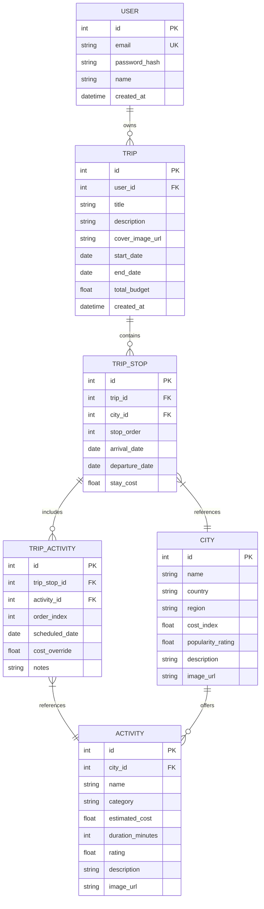

# Streamlined Implementation Plan — GlobeTrotter

This plan focuses directly on engineering quality, high-priority database design, clear architectural layers, and clean execution using **FastAPI + SQLAlchemy + React (Vite/Tailwind)**.

All unnecessary bloat (admin dashboards, complex DnD, public trip cloning, junk normalized tables) has been eliminated. 100% of effort is directed toward building a bulletproof, high-performance travel planning system.

---

## 1. Technical Stack & Architecture

- **Backend**: FastAPI (Python 3.11), SQLAlchemy 2.0 ORM, Pydantic v2 schemas, SQLite (PostgreSQL ready), `passlib` / `bcrypt` for password hashing, `python-jose` for JWT tokens.
- **Frontend**: React (Vite + TypeScript), Tailwind CSS, Lucide Icons, Recharts (for budget visualization), React Router DOM.
- **Data & Seeding**: Self-contained seed script populating 15+ global destinations and 60+ categorized activities.

### Project Architecture (Separation of Concerns)
```
backend/
├── app/
│   ├── main.py              # FastAPI app initialization, CORS, router inclusion
│   ├── core/
│   │   ├── config.py        # Settings & ENV variables
│   │   └── security.py      # JWT creation, password hashing, current_user dependency
│   ├── db/
│   │   ├── session.py       # SQLAlchemy engine & session maker
│   │   └── base.py          # Base model declarative class
│   ├── models/              # SQLAlchemy DB models (User, City, Activity, Trip, TripStop, TripActivity)
│   ├── schemas/             # Pydantic v2 schemas for request validation & responses
│   ├── services/            # Business logic (Budget calculation engine, Itinerary builder, Search)
│   └── api/                 # Endpoint routers (/auth, /cities, /activities, /trips)
├── seed.py                  # Database seeder script
└── requirements.txt

frontend/
├── src/
│   ├── components/          # Reusable UI (Navbar, Cards, Modals, Loading states, Badges)
│   ├── pages/               # 5 Primary Screens (Auth, Dashboard/Trips, Builder/Itinerary, Catalog, Budget)
│   ├── services/            # Axios / Fetch API client with auth interceptors
│   ├── types/               # TypeScript interface definitions matching backend schemas
│   ├── App.tsx              # Routing & auth state provider
│   └── main.tsx
```

---

## 2. Refined Relational Database Schema Design

The schema is clean, normalized without excess, with explicit constraints, foreign keys, and indexes designed for scalability.



### Key Schema Decisions & Performance Indexing
1. **No Junk Tables**:
   - `total_budget` stored directly on `TRIP` (no redundant `TRIP_BUDGET` table).
   - `image_url` stored directly on `CITY` (no redundant `CITY_IMAGE` table).
2. **Cascading Deletes**: `TRIP_STOP` and `TRIP_ACTIVITY` have `ondelete="CASCADE"` foreign keys attached to `TRIP` and `TRIP_STOP`.
3. **Compound & Query Indexes**:
   - `ix_trips_user_created`: `(user_id, created_at DESC)` for instantaneous loading of user trips.
   - `ix_cities_search`: `(country, region, popularity_rating DESC)` for city discovery filtering.
   - `ix_activities_city_category`: `(city_id, category)` for fast retrieval of stop-specific activity choices.
   - `ix_trip_stops_ordering`: `(trip_id, stop_order)` for sequential day itinerary rendering.
   - `ix_trip_activities_order`: `(trip_stop_id, order_index)` for ordered daily activity schedule.

---

## 3. The 5 Core Application Screens

### Screen 1: Auth (Login & Signup)
- Email/Password form with client validation and FastAPI error handling.
- Demo Login button ("Instant Demo User") for one-click evaluator login.
- JWT token handling with automatic bearer header injection.

### Screen 2: Dashboard & My Trips (`/dashboard`)
- Summary bar: Total Trips, Upcoming Trips, Total Planned Budget.
- "Plan New Trip" modal: Title, date range picker, target budget, description, cover photo selection.
- Trip Cards Grid: Card showing destination list summary, dates, duration, total stops, budget usage progress bar, Edit/Delete triggers.

### Screen 3: Itinerary Builder & Day-Wise View (`/trips/:id`)
- Dual-pane or structured list layout:
  - **Left / Top Pane**: Multi-city stop flow (Add City Stop modal, arrival/departure dates, stay cost, reorder stops with up/down position controls).
  - **Right / Bottom Pane**: Day-by-day itinerary sequence showing scheduled activities, durations, cost items, notes, and activity removal/addition.

### Screen 4: City & Activity Catalog Search (`/catalog`)
- Search bar with real-time filters:
  - Search by City or Activity Name.
  - Filter by Country/Region (Europe, Asia, Americas, Africa, Oceania).
  - Filter Activities by Category (Sightseeing, Food & Dining, Adventure, Culture).
- Quick "Add Activity to Trip" drawer/modal.

### Screen 5: Financial Breakdown & Budget Analytics (`/trips/:id/budget`)
- Summary Cards: Total Budget, Calculated Total Expenses (Stay + Activities), Remaining Balance, Daily Average Expense.
- **Recharts Financial Visualization**:
  - Donut / Pie Chart showing expense breakdown by Category (Stay / Accommodation, Sightseeing, Food, Adventure, Transport/Other).
- Over-budget status alert banner when total cost exceeds target budget.

---

## 4. Engineering Quality & Technical Justification for Judges

1. **Database Reasoning**: Clean 3rd Normal Form (3NF) relational design with explicit index structures, CASCADE foreign key constraints, and zero redundant tables.
2. **Business Logic & Service Layer**: `BudgetService` in FastAPI calculates stay costs + activity costs + overrides in O(N) time with aggregated DB queries, avoiding N+1 performance bottlenecks.
3. **Security & Data Validation**: Strict Pydantic v2 models validate all payload bodies; password hashing uses `bcrypt` with work factor 12; endpoints enforce user ownership via JWT dependency.
4. **Reliability & Edge Cases**: Proper HTTP exception responses (401, 403, 404, 422), fallback states for empty trips or missing dates, clean frontend toast notifications.

---

## 5. Verification Plan

### Automated Database & Backend Setup
```bash
# Backend Setup & Seed
cd backend
python -m venv venv
venv\Scripts\activate  # Windows
pip install -r requirements.txt
python seed.py
pytest  # Or sanity check script
```

### Manual Verification Checklist
1. **Auth Verification**: Login as seeded test user (`user@globetrotter.com` / `password123`) & test new registration.
2. **Trip Lifecycle**: Create trip "European Summer Tour 2026", set budget $3,000, set dates.
3. **Multi-City Itinerary**: Add Paris (3 days) and Rome (4 days). Reorder stops.
4. **Activity Assignment**: Add "Eiffel Tower Tour" and "Louvre Museum" to Paris stop; add "Colosseum Walking Tour" to Rome stop.
5. **Budget Calculation & Recharts**: Open Budget view, verify stay costs + activities sum correctly, check Recharts pie chart, test over-budget alert by lowering target budget.

---

## 6. Proposed Implementation Steps

- **Step 1**: Set up FastAPI backend directory structure, models, database session, schemas, and security.
- **Step 2**: Create rich database seed script (`seed.py`) with 15 cities and 60 activities.
- **Step 3**: Implement API endpoints for `/auth`, `/cities`, `/activities`, and `/trips` (with stops and activities endpoints).
- **Step 4**: Build React frontend app with Vite, Tailwind CSS, React Router, Recharts, and API service integration.
- **Step 5**: Implement 5 core screens (Auth, Dashboard/Trips, Builder/Itinerary, Catalog Search, Budget Analytics).
- **Step 6**: Execute full end-to-end verification flow and confirm clean execution.

Please review the revised plan and click **Proceed** to begin implementation.
